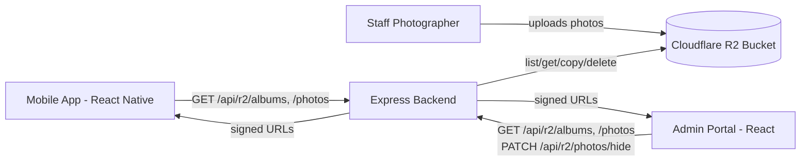

# Ames After Dark — Photo Gallery System

A case study of the photo gallery system I designed and built end-to-end for **Ames After Dark**, a cross-platform nightlife companion app built by a 7-person senior design team over two semesters at Iowa State University. The app shipped to the iOS App Store after passing Apple's compliance review.

This repo isolates the gallery system specifically — the one piece of the app I owned almost entirely on my own — pulled out of our team's private monorepo as a standalone case study.

**Live project links:**
- [Senior Design Project Site](https://sdmay26-42.sd.ece.iastate.edu/) — full project writeup, presented to faculty and peer teams
- [Ames After Dark Website](https://amesafterdark.com/) — public-facing site, also our API's domain

---

## What This System Does

Every weekend, staff photographers at partner bars upload event photos to a shared Cloudflare R2 bucket. The mobile app displays those photos to users grouped by bar and date, and a web-based admin dashboard lets photographers moderate their own uploads (hiding inappropriate photos without permanently deleting them).

There's no photo database — R2 folder structure *is* the data model. That was a deliberate choice by our team lead to keep the upload workflow simple for non-technical photographers (just drop files in a correctly-named folder) and to keep the app's read path simple (list objects, parse folder names). I designed the pagination, image delivery, and moderation logic around that constraint.

---

## Architecture



- **Mobile app** (React Native / Expo) — browses albums and photos, full-screen viewer, photo downloads
- **Admin portal** (React) — role-gated dashboard for staff photographers to moderate uploads
- **Backend** (Node.js / Express) — talks to R2 via the AWS S3 SDK (R2 is S3-compatible), handles pagination, signed URL generation, and soft-delete
- **Storage** (Cloudflare R2) — no database; folder names encode bar name + date

---

## Key Engineering Decisions

### 1. Paginating past R2's 1,000-object limit
R2's `ListObjectsV2` API caps each response at 1,000 objects, and a single weekend across multiple bars easily exceeds that. [`listR2Objects`](./backend/r2Routes.js) loops on the `ContinuationToken` R2 returns until every page has been fetched, so the app never silently truncates a large upload batch.

### 2. Folder structure as the data model
Photos live in R2 under folders like `Sips 4-12/`, parsed by [`parseFolderName`](./backend/r2Routes.js) into a display name and date. This avoids a separate database and metadata-entry step — photographers just create a correctly-named folder and upload. The tradeoff is that the app's "recency window" (only showing the last 7 days) is baked into the read logic rather than being a simple query — see [`getLatestWeekAlbums`](./mobile-app/galleryService.ts), which also de-duplicates to the most recent album per bar per day-of-week.

### 3. Cloudflare edge image transformation
Rather than serving full-resolution photos in a scrolling grid, [`getResizedImageUri`](./mobile-app/galleryService.ts) rewrites R2 URLs into Cloudflare's `/cdn-cgi/image/` resizing syntax, requesting appropriately-sized, compressed images at the edge. This meaningfully cut mobile load times and bandwidth, especially in a grid view rendering dozens of thumbnails.

### 4. Soft-delete via copy-then-delete
R2 (like S3) has no native "rename" operation. To let photographers hide a photo without permanently destroying it, the [`/photos/hide`](./backend/r2Routes.js) route copies the object to a new key prefixed with `hidden_`, then deletes the original. Hidden photos are filtered out of both the albums and photos endpoints, so they disappear from the app instantly while remaining recoverable in the bucket.

### 5. Role-gated moderation dashboard
The admin portal's photographer role and auth flow were built by a teammate; I used that existing infrastructure to design and build the [`Photographer`](./admin-portal/Photographer.jsx) view from scratch — album browsing, a photo grid, and a hide action with an optimistic UI update (the photo disappears from the grid immediately, before the network request resolves) plus a confirmation step to prevent accidental deletions.

---

## Code Highlights

**Pagination loop** ([`backend/r2Routes.js`](./backend/r2Routes.js)):
```js
async function listR2Objects(prefix = '') {
  let isTruncated = true;
  let continuationToken = undefined;
  const allContents = [];

  while (isTruncated) {
    const command = new ListObjectsV2Command({
      Bucket: CLOUDFLARE_R2_BUCKET,
      Prefix: prefix,
      ContinuationToken: continuationToken,
    });
    const response = await s3.send(command);
    if (response.Contents) allContents.push(...response.Contents);
    isTruncated = response.IsTruncated;
    continuationToken = response.NextContinuationToken;
  }
  return allContents;
}
```

**Image resizing URL construction** ([`mobile-app/galleryService.ts`](./mobile-app/galleryService.ts)):
```ts
export function getResizedImageUri(originalUri: string, width: number = 400): string {
  const urlObj = new URL(originalUri);
  if (urlObj.hostname.includes(RAW_DOMAIN) || urlObj.hostname.includes("r2.cloudflarestorage.com")) {
    const imagePath = urlObj.pathname;
    return `${IMAGE_DOMAIN}/cdn-cgi/image/width=${width},quality=80,format=auto,onerror=redirect${imagePath}`;
  }
  return originalUri;
}
```

**Soft-delete route** ([`backend/r2Routes.js`](./backend/r2Routes.js)):
```js
router.patch('/photos/hide', async (req, res) => {
  const { key } = req.body;
  const parts = key.split('/');
  const fileName = parts.pop();
  const folderPath = parts.join('/');
  const newKey = folderPath ? `${folderPath}/hidden_${fileName}` : `hidden_${fileName}`;

  await s3.send(new CopyObjectCommand({
    Bucket: CLOUDFLARE_R2_BUCKET,
    CopySource: `${CLOUDFLARE_R2_BUCKET}/${encodeURI(key)}`,
    Key: newKey,
  }));
  await s3.send(new DeleteObjectCommand({ Bucket: CLOUDFLARE_R2_BUCKET, Key: key }));

  res.json({ success: true, message: 'Photo hidden successfully', newKey });
});
```

---

## Scope Note

This repo covers the photo gallery system specifically, extracted from a larger team codebase built by a 7-person senior design team. I designed and built this system almost entirely independently, with the team's founder providing account access and early direction. Authentication infrastructure, the bar directory, and other parts of the app referenced here (e.g. `useRoles()` in the admin portal) were built by teammates and are intentionally not included in this repo.